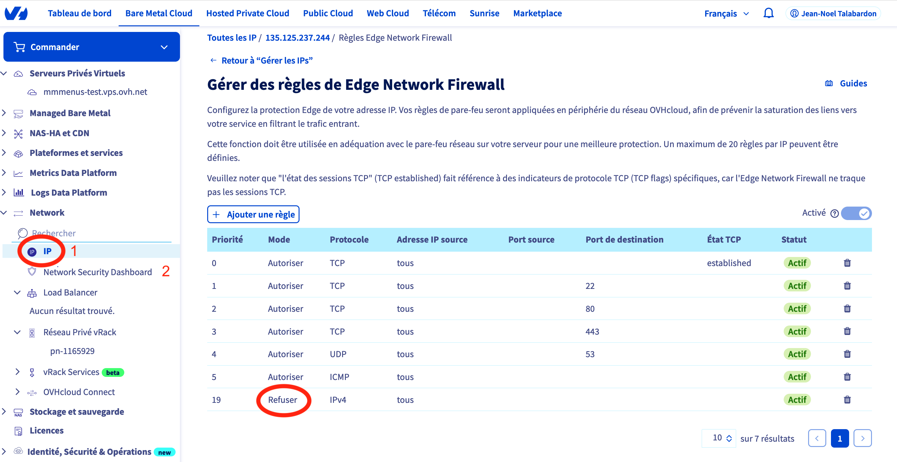
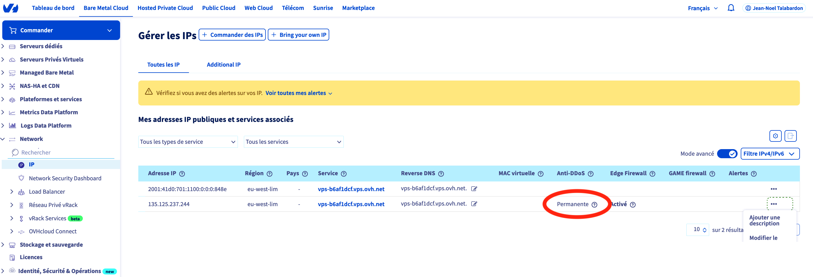

# MMMenus :: OVH VPS :: Sécurité

https://help.ovhcloud.com/csm/fr-vps-security-tips?id=kb_article_view&sysparm_article=KB0047708

## Checklist
* [x] OVH Firewall VPS
* [x] Fail2Ban pour SSH
* [ ] Fail2Ban pour backend Flask
* [x] Let's Encrypt pour NGInx
* [ ] Captcha (A l'inscription et périodiquement à l'authentification)
* [ ] Strong Password checking in frontend
* [ ] Strong Password checking in backend
* [ ] Double Authentification (périodiquement pour les utilisateurs, systèmatiquement pour les admins)

## Instructions

### OVH Firewall VPS

TODO

https://help.ovhcloud.com/csm/fr-vps-security-tips?id=kb_article_view&sysparm_article=KB0047708

https://help.ovhcloud.com/csm/fr-dedicated-servers-firewall-network?id=kb_article_view&sysparm_article=KB0043455

> Exemple de configuration :  ports SSH (22), HTTP (80), HTTPS (443) et UDP (53) restent ouverts lors de l'autorisation de l'ICMP, suivez les règles ci-dessous :



Sélectionnez Mitigation : mode permanent

### Tableau de bord Anti-DDoS (scrubbing)

https://www.ovh.com/manager/#/dedicated/network-security/scrubbing-center


### IPTables
TODO

### Fail2Ban
TODO

#### Install

https://help.ovhcloud.com/csm/fr-dedicated-servers-securing-server?id=kb_article_view&sysparm_article=KB0043978

```bash
sudo apt install -y fail2ban
sudo cp /etc/fail2ban/jail.conf /etc/fail2ban/jail.local
sudo nano /etc/fail2ban/jail.local
sudo service fail2ban restart
```

#### Fail2Ban pour Serveur SSH (22)
TODO

https://help.ovhcloud.com/csm/fr-dedicated-servers-securing-server?id=kb_article_view&sysparm_article=KB0043978

#### Fail2Ban pour Auth on Backend MMMenus (80,443)
TODO
Voir `[nginx-http-auth]` dans `/etc/fail2ban/jail.local`

### Let's Encrypt

TODO --> https://phoenixnap.com/kb/letsencrypt-docker

### Captcha
TODO
A l'inscription et périodiquement à l'authentification

### Strong Password
TODO

https://github.com/dropbox/zxcvbn

Strong Password Meter https://github.com/miladd3/vue-simple-password-meter https://madewithvuejs.com/vue-password-strength-meter

### Double Authentification
TODO
périodiquement pour les utilisateurs, systèmatiquement pour les admins

